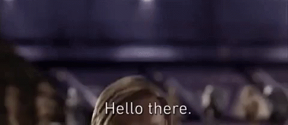

     
# Welcome to my GitHub profile :rocket: :milky_way:     
    
## I am a first-grade software engineering student :computer:    
   
## I am currently learning ML, I am interested on AI technologies  
   
## I am trying to improve my skills on C++ and DSA    you can check my repositories that I made wtih tutorial or alone.     

## I like learning and building things and you can find many beautiful things here, I believe you will love them        
     
## I believe you will find many things in here I will keep going to add some repositoires and I am gonna share some of my projects in here  

# Languages, tools and technologies that I have experience with     
   

# Languages, tools and technologies that I am learning currently    

